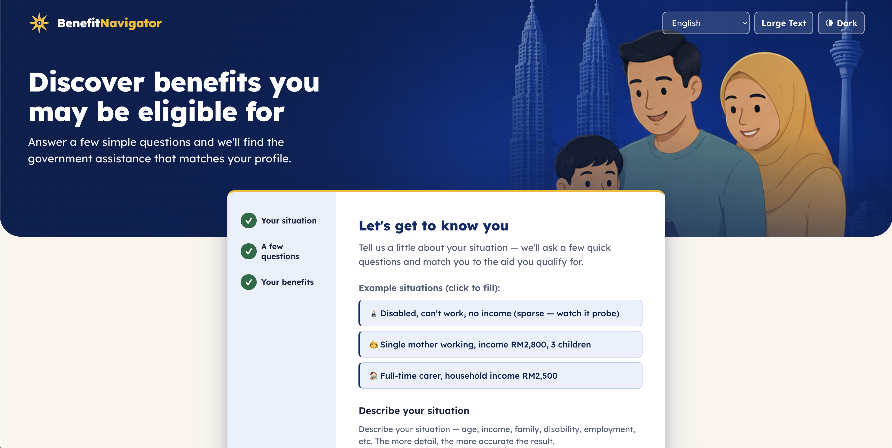
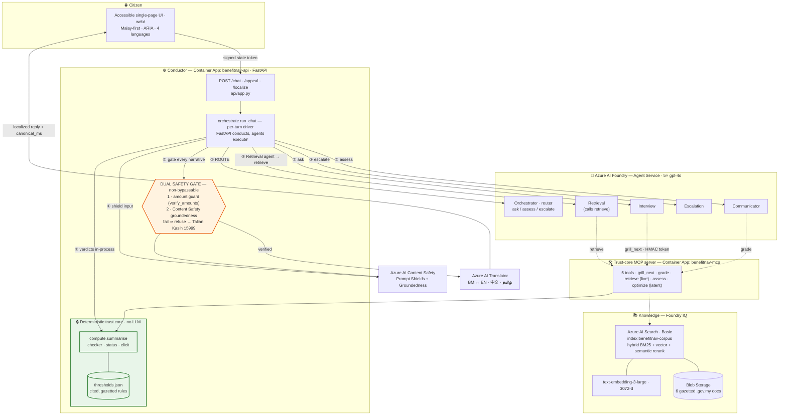
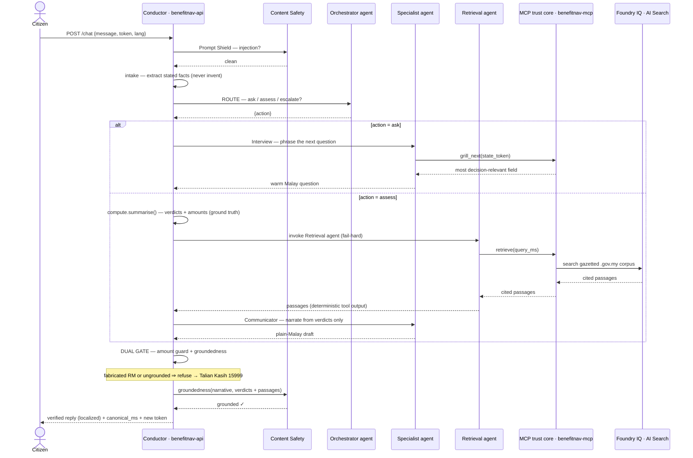

# Benedet (previous BenefitNavigator-MY)

**Find the government benefits you're actually entitled to — explained in plain language, with every claim traceable to a gazetted source, and a safety net that refuses to guess.**

Millions of eligible Malaysians never claim benefits they qualify for — the rules are scattered across JKM, PERKESO and LHDN documents, written in dense officialese, and "Am I eligible?" has no single answer. BenefitNavigator runs a short, adaptive conversation in Bahasa Melayu and returns: which benefits you already qualify for (with amounts), which you *almost* qualify for and the one action that would unlock them, and a ready-to-send appeal letter — all grounded in official sources.

Built for the **Microsoft Agents League** hackathon — a **multi-agent reasoning system on Azure AI Foundry**, fully cloud-hosted (no laptop in the loop).

> **Live demo:** <https://benefitnav-api.ashyocean-f47e8ddf.swedencentral.azurecontainerapps.io>
> *(May be scaled to zero between demos to conserve credit — see [Cost & teardown](#cost--teardown).)*

## 🎥 Demo walkthrough

[](https://youtu.be/mCWazrbBqCk)

> ▶️ **[Watch the walkthrough on YouTube](https://youtu.be/mCWazrbBqCk)**

---

## Why this is trustworthy (the core idea)

A benefits assistant that can *hallucinate an entitlement* is worse than no assistant. So the architecture draws a hard line between the two things LLMs are good and bad at, and **no agent can cross it**:

- **The LLM never decides eligibility or does arithmetic.** A deterministic Python core (`compute/`) reads a curated, **citation-backed** rules file (`thresholds.json`) and computes every verdict. The rules encode the *legal income concept* per programme (individual vs household income are distinct), with inclusive `≤` boundaries — pinned by unit tests.
- **Agents only orchestrate, ask, retrieve, and narrate.** Every agent narrative passes a **dual safety gate** in FastAPI before a citizen ever sees it:
  1. a **deterministic amount guard** — every `RMxxx` in the answer must trace to a verdict, the citizen's stated income, or a gazetted threshold (catches a fabricated "RM9000/month" precisely);
  2. **Azure AI Content Safety Groundedness** detection against the verdicts + cited passages.
  If either fails, the app **refuses and routes to a human** (Talian Kasih 15999) instead of emitting an unverifiable answer.
- **The gate is structural, not advisory.** Each agent's instructions also forbid inventing amounts — but that's only a *second* line of defence. Even an agent that ignored its instructions cannot emit an unverifiable figure, because the conductor recomputes the verdicts itself and refuses any narrative that doesn't match.
- **Prompt Shields** screen every free-text input for jailbreak/injection before processing.
- **Cite-or-refuse:** every eligible/near-miss verdict carries a `.gov.my` source link.

---

## Architecture

BenefitNavigator is a **multi-agent system on Azure AI Foundry** conducted by a FastAPI service. Five gpt-4o agents own the *language and flow* of the conversation; a deterministic trust core — reachable only through an MCP server — owns the *truth*.


<details>
<summary><b>Component diagram</b> — the same system as Mermaid source (click to expand)</summary>



</details>

The full architecture — the one-page **Foundry overview** plus the component, per-turn sequence, and deployment / trust-boundary views, with the design rationale — is in [`docs/ARCHITECTURE.md`](docs/ARCHITECTURE.md).

### The five Foundry agents

| Agent | Role | MCP tools | On the live `/chat` turn |
|---|---|---|---|
| **Orchestrator** | Router — reads the message + deterministic situation and picks **one** action: ask / assess / escalate. Produces no facts or amounts. | *(tool-less)* | ✓ every turn |
| **Interview** | Asks the single most decision-relevant question next, phrased warmly. It never *chooses* the field — `grill_next` does. | `grill_next` | ✓ on **ask** |
| **Communicator** | Explains the verdict in plain Bahasa Melayu and drafts appeal letters — strictly from the supplied verdicts. | `grade` | ✓ on **assess** |
| **Escalation** | Hands off to a human (Talian Kasih 15999, district JKM/LHDN) without a dead-end. | *(none)* | ✓ on **escalate** |
| **Retrieval** | Formulates a Malay search query and calls `retrieve` to ground the narrative in cited `.gov.my` passages (the conductor uses the tool's deterministic output). | `retrieve` | live agent\* |

\* **"FastAPI conducts, agents execute" (Option 1).** Same-project Foundry→Foundry A2A delegation is an open platform bug ([azure-sdk-for-python #47419](https://github.com/Azure/azure-sdk-for-python/issues/47419)), so the Orchestrator is a *tool-less router*: it returns a decision and the conductor invokes the chosen specialist directly via the Responses API. Verdicts are computed in-process (`compute.summarise`) because the **dual gate must own the trust-critical values** rather than round-trip them through an LLM — so there is no Assessor agent; the `assess`/`optimize` MCP tools remain as latent, unit-tested trust-core surface. Retrieval IS a live agent: it formulates the query and calls `retrieve`, and the conductor captures the tool's deterministic output.

### One turn, end to end

Each `/chat` turn is a pure transform of the signed state token (the citizen's facts live *inside* the HMAC-signed token; an agent can relay it but cannot alter the facts in it):



**Fail-hard by design.** Every external dependency fails closed, never silent: if an agent is unavailable (after retries) or returns an unusable result, the turn fails with `action="error"` — the conductor never substitutes locally for an agent's job. Verdicts are COMPUTED independently of retrieval (`compute.summarise` runs first), but the assess turn cannot COMPLETE without the Retrieval agent. A *present but unverifiable* narrative still refuses (cite-or-refuse); a fabricated `RM` figure trips the amount guard precisely.

### Language model

The pipeline reasons and verifies entirely in **Bahasa Melayu**. Every response carries `canonical_ms` (the verified Malay payload — the source of truth) plus the display text localized to the requested language. Clients re-localize toggles from `canonical_ms` via `/localize`, so an already-translated language is never re-translated.

---

## Azure services

| Layer | Service | Role |
|---|---|---|
| Agents | **Azure AI Foundry — Agent Service** (5× gpt-4o) | the multi-agent reasoning layer: route, interview, narrate, escalate, retrieve |
| Conductor | **Azure Container Apps** — `benefitnav-api` | FastAPI: per-turn orchestration + the non-bypassable dual gate + the UI |
| Trust tools | **Azure Container Apps** — `benefitnav-mcp` | the MCP server exposing the deterministic core (5 tools) to the agents |
| Knowledge (IQ) | **Azure AI Search** (Basic) + Foundry IQ knowledge base | agentic retrieval, hybrid + semantic rerank, extractive citations |
| Reasoning | **Azure OpenAI gpt-4o** | agent inference + intake extraction + query planning |
| Embeddings | **text-embedding-3-large** (3072-dim) | index + query-time vectorization |
| Safety | **Azure AI Content Safety** | Prompt Shields + Groundedness detection (the dual gate's soft guard) |
| Language | **Azure AI Translator** | BM ↔ EN / 中文 / தமிழ் |
| Corpus | **Azure Blob Storage** | source-of-truth `.gov.my` documents |

Reasoning + safety run on one **AIServices** multi-service resource (`benefitnav-ai-sc-79c45`, `swedencentral`); Search is a separate Basic service. Keys are fetched at runtime via the `az` CLI (locally) or injected as Container Apps secrets (in cloud) — **never committed**.

### Data sources (corpus)
Six machine-readable `.gov.my` documents, chunked with citation-first locators (Akta *Seksyen N*, FAQ *S{n}*, guideline headings):

- JKM Garis Panduan Pengurusan Bantuan Kewangan Persekutuan (2018) — BTB, EPC, BPT, BOT
- PERKESO booklet (2025) — Return-To-Work
- Akta OKU 2008 (Act 685)
- LHDN STR 2026 application FAQ, STR 2026 payment FAQ, SARA 2026 FAQ

---

## Deployment

Both services run as **Azure Container Apps** in `rg-benefitnav-my` (`swedencentral`) — the demo is fully cloud-hosted, no laptop in the loop. The conductor authenticates to Foundry with a **system-assigned managed identity** (`Azure AI Developer` role on the AIServices account), so it needs no `az` CLI and no committed keys.

```bash
bash infra/deploy-api.sh        # build → create/update → grant role → smoke (conductor)
```

`deploy-api.sh` is idempotent and ends with a smoke test that **fails unless a Foundry agent actually responded** (it asserts the per-turn trace `ROUTE.status == "ok"`, not merely HTTP 200 — the system fails closed *silently*, so a 200 alone proves nothing). Full resource details: [`infra/azure-resources.md`](infra/azure-resources.md).

---

## Local development

Running locally is optional (dev only — the live demo is the cloud deployment).

**Prerequisites:** Python 3.12, Azure CLI logged in (`az login`) with access to `rg-benefitnav-my`.

```bash
cd benefitnav
python3 -m venv .venv
.venv/bin/pip install -r requirements.txt
az login                          # keys are fetched at runtime via the CLI

# The conductor signs /chat state tokens with an HMAC secret that MUST match the
# MCP container's, or every trust-tool call fails. It is resolved automatically
# (env var → else `az containerapp secret show`); to run fully offline, export it:
export BENEFITNAV_TOKEN_SECRET="<same value as the benefitnav-mcp 'token-secret'>"

PYTHONPATH="$PWD" .venv/bin/python -m uvicorn api.app:app --port 8011
# open http://localhost:8011   (or: bash start.sh)
```

### Build the index + knowledge base (one-time)
```bash
PYTHONPATH="$PWD" .venv/bin/python -m ingest.build         # chunk → embed → index (~400 chunks)
PYTHONPATH="$PWD" .venv/bin/python -m ingest.search_smoke  # Step A: cited retrieval works
PYTHONPATH="$PWD" .venv/bin/python -m ingest.kb_smoke      # Step B: agentic retrieval works
```

### (Re)provision the Foundry agents
```bash
BENEFITNAV_MCP_URL="https://benefitnav-mcp.ashyocean-f47e8ddf.swedencentral.azurecontainerapps.io/mcp" \
  PYTHONPATH="$PWD" .venv/bin/python -m mas.provision      # idempotent; creates the 5 agents + MCP tools
```

---

## API

| Endpoint | Purpose |
|---|---|
| `POST /chat` | Advance one conversation turn through the multi-agent layer, with the dual gate enforced. Returns the new signed `token`, the localized `reply`, and (on an assess turn) the verified `result` + `canonical_ms`. |
| `POST /chat/stream` | The same turn as `/chat`, streamed as Server-Sent Events — emits per-stage and per-agent progress (which agent is running, the MCP trust tools it calls, the question/narrative forming token-by-token), then a terminal `done` (verified turn) or `error` (a Foundry agent was unreachable — fail-hard) event. The dual safety gate still runs server-side before any `done` is emitted. This is the path the UI uses for the live demo. |
| `POST /appeal` | Draft a *surat rayuan* for one near-miss programme, localized. |
| `POST /localize` | Re-localize an already-verified Malay payload into another language (instant toggles — no re-run). |
| `GET /health` | Liveness + supported languages. |
| `GET /` | The accessible single-page UI. |

---

## Tests

```bash
# fast, deterministic unit tests (no Azure, no cost) — the trust core + the gate
PYTHONPATH="$PWD" .venv/bin/python -m pytest tests/ -q

# live end-to-end tests (calls Azure; a few cents)
PYTHONPATH="$PWD" .venv/bin/python -m pytest tests/ -m integration -v
```

The unit suite pins the eligibility rules (individual-vs-household income, inclusive boundaries, SARA OR-logic, STR category routing), the anti-fabrication amount guard, and the `/chat` turn contract (skip handling, fail-closed degrade vs refuse). `pytest.ini` excludes integration by default, so the standard run never touches Azure.

---

## Project structure

```
benefitnav/
├── compute/         the deterministic trust core — NO LLM imports allowed here
│   ├── thresholds.json  curated, citation-backed rules (a benefit = a data edit, not code)
│   ├── profile.py   validated immutable Applicant
│   ├── checker.py   pure eligibility evaluators
│   ├── status.py    eligible + GAP/near-miss analysis
│   └── elicit.py    Kleene three-valued grill engine (deterministic next-question)
├── mas/             the multi-agent layer (Foundry + MCP)
│   ├── agents.py    the 5 agent definitions (instructions + tools) — pure data
│   ├── provision.py creates the agents in Foundry Agent Service
│   ├── mcp_server.py  the trust-core MCP server (5 tools) — benefitnav-mcp
│   ├── trust_tools.py  the tool implementations over compute/
│   ├── orchestrate.py  the per-turn /chat driver (FastAPI conducts)
│   └── state.py     HMAC-signed conversation state token
├── ingest/          corpus → Azure AI Search index → Foundry IQ knowledge base
│   ├── build.py · chunker.py · index_schema.py
│   └── knowledge_base.py  agentic (extractive, cited) retrieval
├── agent/           the LLM touchpoints + the gate
│   ├── intake.py · narrate.py · appeal.py
│   ├── safety.py    Prompt Shields + Groundedness
│   ├── verify.py    deterministic amount guard
│   ├── translate.py · localize.py   i18n
│   └── orchestrator.py  the original single-pipeline (shared constants; trust core)
├── api/app.py       FastAPI: /chat, /appeal, /localize, /health, /
├── web/             accessible single-page UI (BM default, ARIA, 4 languages)
├── infra/           deploy-api.sh · Dockerfile(.api) · azure-resources.md · teardown.sh
└── tests/           unit (fast) + integration (live)
```

---

## Cost & teardown

Pay-per-token services (gpt-4o, embeddings, translate) are near-zero when idle. The continuous meters are **Azure AI Search Basic (~$2.45/day)** and **two always-on Container Apps** (`benefitnav-api` + `benefitnav-mcp`, `minReplicas=1`). The subscription is FreeTrial with the **spending limit ON**, so it hard-stops at credit exhaustion — it cannot surprise-bill.

```bash
# stop just the conductor's continuous billing (keeps everything provisioned)
az containerapp update -n benefitnav-api -g rg-benefitnav-my --min-replicas 0

# full teardown — deletes the resource group + purges soft-deleted accounts
bash infra/teardown.sh
```

⚠️ **Run teardown (or scale to zero) after the demo** — the Search meter runs 24/7.

---

## Honest limitations
- **"FastAPI conducts, agents execute."** Same-project Foundry→Foundry A2A delegation is an open platform bug, so the delegation hop lives in the conductor rather than in a single Orchestrator-over-A2A call (see the [Architecture](#architecture) note). Genuine multi-agent on Foundry; only the network hop moved.
- **gpt-4o quota.** The deployment is small (Standard, 50K TPM). Rapid back-to-back turns can 429 the shared deployment("Couldn't reach the assistant just now. Please try again."). The conductor retries once, then fails the turn hard (`action="error"`). A real demo (one call per turn) is comfortable.
- **i18n translates the explanation, not the chrome.** The generated narrative is translated to EN / 中文 / Tamil on demand; the UI labels are Malay-first (because the data source are in Malay).
