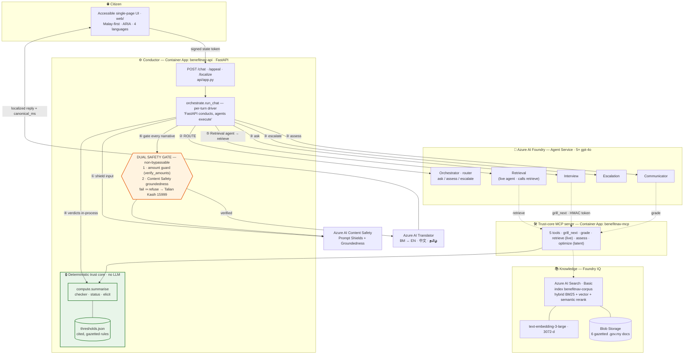
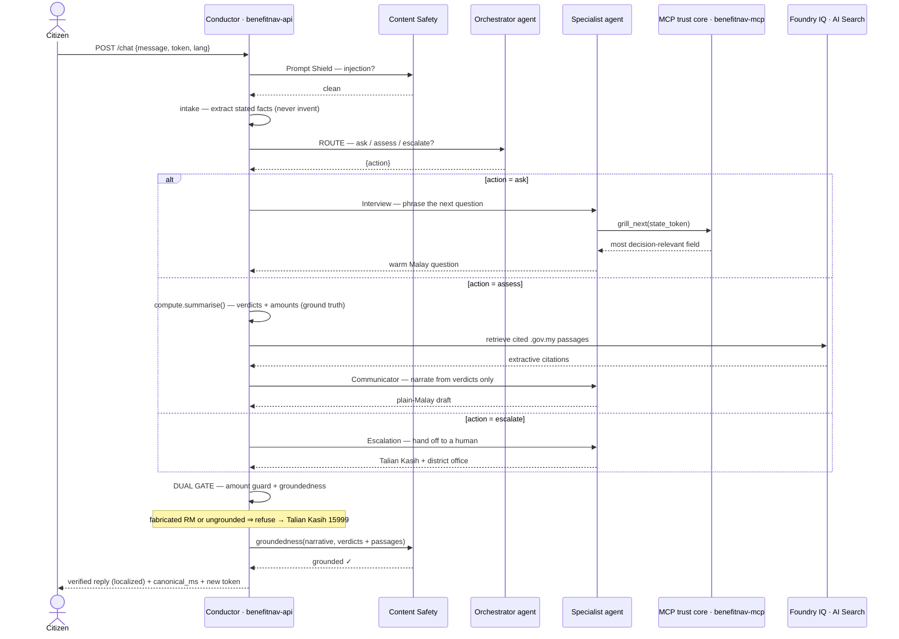
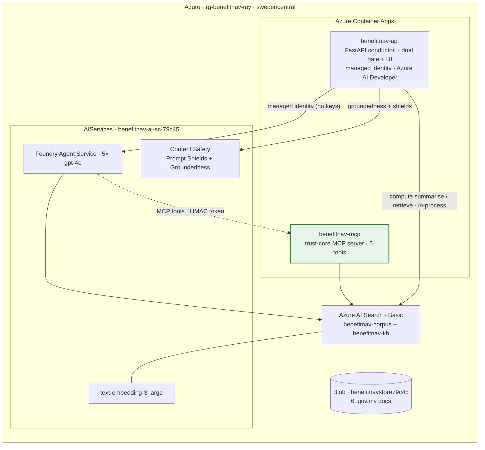

# Architecture — BenefitNavigator Malaysia

> **Diagrams pending regeneration (2026-06-13):** the PNGs in `docs/diagrams/` still show the
> pre-change topology (6 agents; Assessor + Retrieval in-process). After this change: 5 agents,
> Retrieval is a live agent calling `retrieve`, and there is no Assessor agent. Regenerate from
> the mermaid sources above before publishing.

A **multi-agent reasoning system on Azure AI Foundry**, conducted by a FastAPI service, with a deterministic trust core that the agents can reach **only** through an MCP server. The design separates the two things LLMs are good and bad at, and makes the separation *structural*: no agent can decide eligibility or state an amount, because the conductor recomputes the verdicts and a non-bypassable gate refuses anything that doesn't match.

This document expands on the overview in [`../README.md`](../README.md) with three views: the **component diagram**, the **per-turn sequence**, and the **deployment / trust boundary**. The Mermaid sources below render on GitHub; pre-rendered PNGs are in [`diagrams/`](diagrams/) for slides and the submission form.

---

## 1. Component diagram

Five gpt-4o agents own the conversation's *language and flow*; `compute/` owns its *truth*.

| # | Step | Who |
|---|---|---|
| ① | Prompt-Shield the untrusted free text | Content Safety |
| ② | **ROUTE** — pick ask / assess / escalate | Orchestrator agent |
| ③ | **NARRATE** — phrase the question / explanation / hand-off | Interview · Communicator · Escalation |
| ④ | Recompute verdicts + amounts as ground truth | `compute.summarise` (in-process) |
| ⑤ | Retrieve cited `.gov.my` passages for grounding | Retrieval agent → `retrieve` tool |
| ⑥ | **DUAL GATE** every narrative → refuse or emit | `verify` + Content Safety |

---

## 2. Per-turn sequence

The citizen's facts live *inside* an HMAC-signed state token. An agent can relay the token but cannot alter the facts in it — so even a compromised agent cannot smuggle in a false fact.

---

## 3. Deployment & trust boundary

Everything runs in Azure (`rg-benefitnav-my`, `swedencentral`). The **trust boundary** (green) is the only place eligibility and amounts are decided; the LLM layer (blue) is on the *outside* of it and is checked on the way out.

**Credentials.** No keys in the repo. The conductor authenticates to Foundry with its Container App **system-assigned managed identity** (granted `Azure AI Developer` on the AIServices account) — the same `DefaultAzureCredential` code path works locally via `az login`. Search/AOAI keys and the shared HMAC `token-secret` are injected as **Container Apps secrets**. The token-secret is identical on both apps so the conductor's signature verifies on the MCP side.

---

## 4. Why "FastAPI conducts, agents execute" (Option 1)

The intended Foundry topology is an Orchestrator agent that delegates to specialists over **A2A**. Same-project Foundry→Foundry A2A is currently an **open platform bug** ([azure-sdk-for-python #47419](https://github.com/Azure/azure-sdk-for-python/issues/47419)): the agent-card-path validation rejects every delegation, regardless of configuration.

So the delegation hop moved into the conductor. The Orchestrator is a **tool-less router** — it still owns the LLM judgment that matters (ask vs assess vs escalate) — and FastAPI invokes the chosen specialist directly via the Responses API (the path proven in `mas/orchestrate._invoke_agent`). The system stays genuinely multi-agent on Foundry; only the network hop changed.

The **assessment role runs in-process** (no dedicated agent):

| Role | Hosted agent | What the conductor runs | Why in-process |
|---|---|---|---|
| Assessment | (no agent — removed) | `compute.summarise(applicant)` | the **dual gate must own the verdict values** it checks the narrative against |

The `assess`/`optimize` MCP tools remain as latent, unit-tested trust-core surface — callable but unattached to any live agent. Retrieval IS a live agent: the conductor invokes the Retrieval agent on the critical path, it formulates the Malay query and calls `retrieve`, and the conductor captures the tool's deterministic output. If the Retrieval agent is unavailable, the assess turn fails hard (`action="error"`).

---

## 5. The dual safety gate

Every agent narrative passes two checks in FastAPI before the citizen sees it (`mas/orchestrate._gate`):

1. **Amount guard (hard, always).** `verify.verify_amounts` — every `RMxxx` in the text must trace to a verdict amount, the citizen's stated income, a gazetted threshold, or the guaranteed monthly floor. A fabricated figure trips it precisely.
2. **Groundedness (soft).** Azure AI Content Safety checks the narrative against the verdicts + the whitelisted procedural facts (how/where to apply) + the cited passages.

If either trips, the turn **refuses and routes to a human** (Talian Kasih 15999). Two failure modes are handled differently on purpose:

- A narrative that is **present but unverifiable** (fabricated amount / ungrounded) is a real trust violation → **refuse**.
- A **missing** narrative (e.g. the Communicator 429s after retries) fails the turn hard (`action="error"`) — there is no locally-synthesised substitute.

Verdicts are computed independently of the LLM and retrieval (`COMPUTE`/`GAP` run first), but per Foundry-or-fail the Retrieval agent is on the critical path — a turn cannot complete if it is unavailable.
