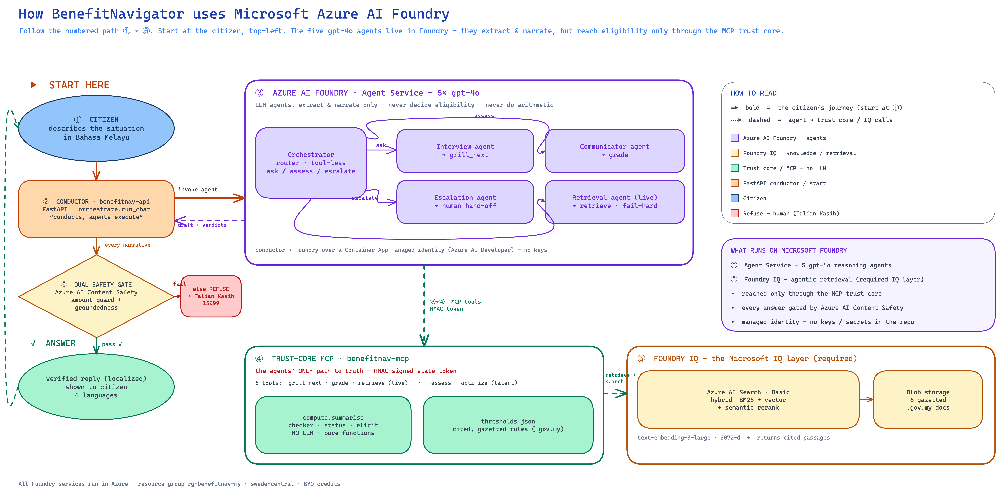
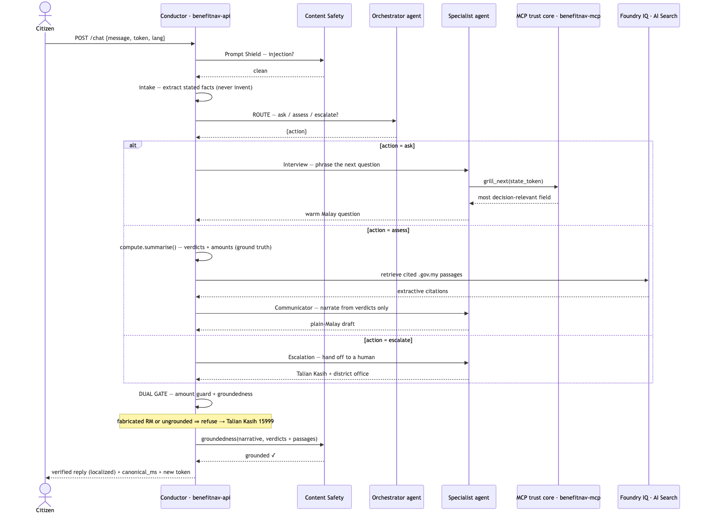

# Architecture — BenefitNavigator Malaysia

A **multi-agent reasoning system on Azure AI Foundry**, conducted by a FastAPI service, with a deterministic trust core that the agents can reach **only** through an MCP server. The design separates the two things LLMs are good and bad at, and makes the separation *structural*: no agent can decide eligibility or state an amount, because the conductor recomputes the verdicts and a non-bypassable gate refuses anything that doesn't match.

This document carries **two diagrams** — the **system overview** above and the **per-turn sequence** in §2 (both are in [`diagrams/`](diagrams/) as PNGs, so they render in slides and the submission form as well as on GitHub). The deployment topology and the trust boundary are described in prose in §3.

---

## 1. System overview

The diagram above is the one-page view of **how the solution uses Microsoft Foundry**: begin at **① the citizen** (top-left) and follow the numbered path. The conductor routes the turn, the five gpt-4o agents in **Azure AI Foundry** do the language work, every fact is fetched through the **MCP trust core**, and the grounding corpus lives in **Foundry IQ**. Five gpt-4o agents own the conversation's *language and flow*; `compute/` owns its *truth*.

| # | Step | Who |
|---|---|---|
| ① | Prompt-Shield the untrusted free text | Content Safety |
| ② | **ROUTE** — pick ask / assess / escalate | Orchestrator agent |
| ③ | **NARRATE** — phrase the question / explanation / hand-off | Interview · Communicator · Escalation |
| ④ | Recompute verdicts + amounts as ground truth | `compute.summarise` (in-process) |
| ⑤ | Retrieve cited `.gov.my` passages for grounding | Retrieval agent → `retrieve` tool |
| ⑥ | **DUAL GATE** every narrative → refuse or emit | `verify` + Content Safety |

The layers the numbered path crosses:

- **Conductor** — Container App `benefitnav-api` (FastAPI). `orchestrate.run_chat` is the per-turn driver — "FastAPI conducts, agents execute." It holds the **dual safety gate** (amount guard + Content Safety groundedness; fail ⇒ refuse → Talian Kasih 15999) and the **deterministic trust core** (`compute.summarise` over `checker · status · elicit`, reading the cited, gazetted `thresholds.json`). No LLM touches the trust core.
- **Azure AI Foundry — Agent Service · 5× gpt-4o** — the Orchestrator (a tool-less router: ask / assess / escalate) plus four specialists: Interview, Communicator, Escalation, and Retrieval (the live agent that calls `retrieve`).
- **Trust-core MCP server** — Container App `benefitnav-mcp`, exposing 5 tools: `grill_next`, `grade`, `retrieve` (live) and `assess`, `optimize` (latent).
- **Knowledge — Foundry IQ** — Azure AI Search (Basic) over the `benefitnav-corpus` index (hybrid BM25 + vector + semantic rerank), `text-embedding-3-large` (3072-d), and Blob Storage holding the 6 gazetted `.gov.my` documents.
- **Cross-cutting** — Azure AI Content Safety (Prompt Shields + Groundedness) and Azure AI Translator (BM ↔ EN · 中文 · தமிழ்).

---

## 2. Per-turn sequence

The citizen's facts live *inside* an HMAC-signed state token. An agent can relay the token but cannot alter the facts in it — so even a compromised agent cannot smuggle in a false fact. Each turn shields the input, routes it, narrates through the chosen specialist, and then — on an assess turn — recomputes the verdicts in-process and grounds the narrative against cited passages before the **dual gate** either emits the verified reply or refuses to a human. A fabricated `RM` figure or an ungrounded claim trips the gate and routes to **Talian Kasih 15999**.

---

## 3. Deployment & trust boundary

Everything runs in Azure (`rg-benefitnav-my`, `swedencentral`). The **trust boundary** is the only place eligibility and amounts are decided; the LLM layer sits *outside* it and is checked on the way out. Of the two Container Apps, only `benefitnav-mcp` (the trust core) is inside the boundary.

**Topology:**

- **Azure Container Apps** — `benefitnav-api` (the FastAPI conductor + dual gate + UI; system-assigned managed identity, `Azure AI Developer`) and `benefitnav-mcp` (the trust-core MCP server, 5 tools — *inside* the trust boundary).
- **AIServices · `benefitnav-ai-sc-79c45`** — the Foundry Agent Service (5× gpt-4o), Content Safety (Prompt Shields + Groundedness), and `text-embedding-3-large`.
- **Azure AI Search · Basic** — the `benefitnav-corpus` and `benefitnav-kb` indexes.
- **Blob · `benefitnavstore79c45`** — the 6 gazetted `.gov.my` documents.
- **Edges** — the conductor reaches Foundry by **managed identity** (no keys) and calls Content Safety for shields + groundedness; the Foundry agents reach the trust core over **MCP carrying the HMAC token**; both the agents and the MCP server query Search, which is backed by the embeddings and the blob corpus.

**Credentials.** No keys in the repo. The conductor authenticates to Foundry with its Container App **system-assigned managed identity** (granted `Azure AI Developer` on the AIServices account) — the same `DefaultAzureCredential` code path works locally via `az login`. Search/AOAI keys and the shared HMAC `token-secret` are injected as **Container Apps secrets**. The token-secret is identical on both apps so the conductor's signature verifies on the MCP side.

---

## 4. Why "FastAPI conducts, agents execute" (Option 1)

The intended Foundry topology is an Orchestrator agent that delegates to specialists over **A2A**. Same-project Foundry→Foundry A2A is currently an **open platform bug** ([azure-sdk-for-python #47419](https://github.com/Azure/azure-sdk-for-python/issues/47419)): the agent-card-path validation rejects every delegation, regardless of configuration.

So the delegation hop moved into the conductor. The Orchestrator is a **tool-less router** — it still owns the LLM judgment that matters (ask vs assess vs escalate) — and FastAPI invokes the chosen specialist directly via the Responses API (the path proven in `mas/orchestrate._invoke_agent`). The system stays genuinely multi-agent on Foundry; only the network hop changed.

The **assessment role runs in-process** (no dedicated agent):

| Role | Hosted agent | What the conductor runs | Why in-process |
|---|---|---|---|
| Assessment | (no agent — removed) | `compute.summarise(applicant)` | the **dual gate must own the verdict values** it checks the narrative against |

The `assess`/`optimize` MCP tools remain as latent, unit-tested trust-core surface — callable but unattached to any live agent. Retrieval IS a live agent: the conductor invokes the Retrieval agent on the critical path, it formulates the Malay query and calls `retrieve`, and the conductor captures the tool's deterministic output. If the Retrieval agent is unavailable, the assess turn fails hard (`action="error"`).

---

## 5. The dual safety gate

Every agent narrative passes two checks in FastAPI before the citizen sees it (`mas/orchestrate._gate`):

1. **Amount guard (hard, always).** `verify.verify_amounts` — every `RMxxx` in the text must trace to a verdict amount, the citizen's stated income, a gazetted threshold, or the guaranteed monthly floor. A fabricated figure trips it precisely.
2. **Groundedness (soft).** Azure AI Content Safety checks the narrative against the verdicts + the whitelisted procedural facts (how/where to apply) + the cited passages.

If either trips, the turn **refuses and routes to a human** (Talian Kasih 15999). Two failure modes are handled differently on purpose:

- A narrative that is **present but unverifiable** (fabricated amount / ungrounded) is a real trust violation → **refuse**.
- A **missing** narrative (e.g. the Communicator 429s after retries) fails the turn hard (`action="error"`) — there is no locally-synthesised substitute.

Verdicts are computed independently of the LLM and retrieval (`COMPUTE`/`GAP` run first), but per Foundry-or-fail the Retrieval agent is on the critical path — a turn cannot complete if it is unavailable.
